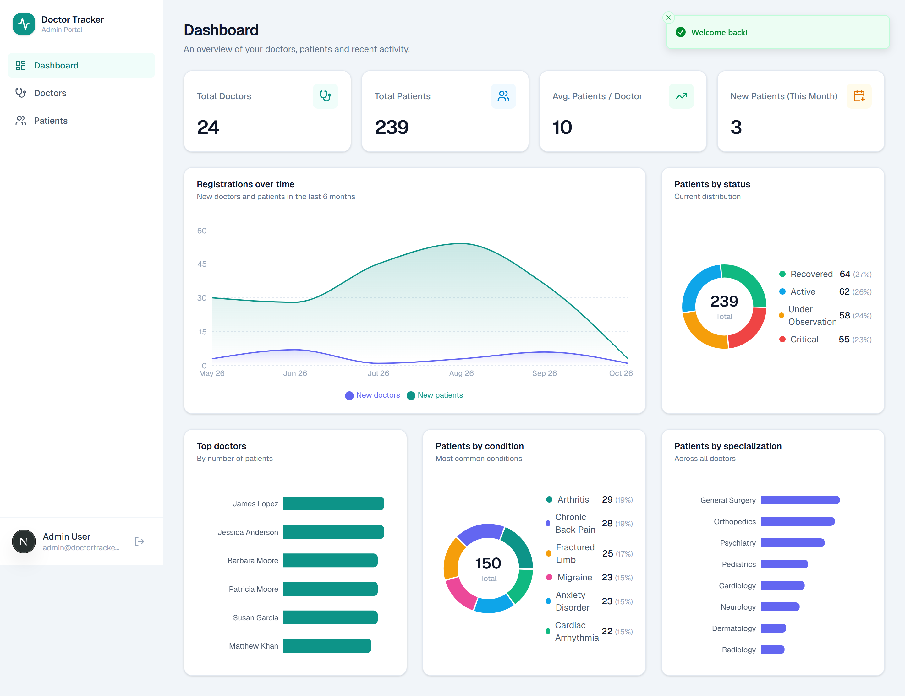
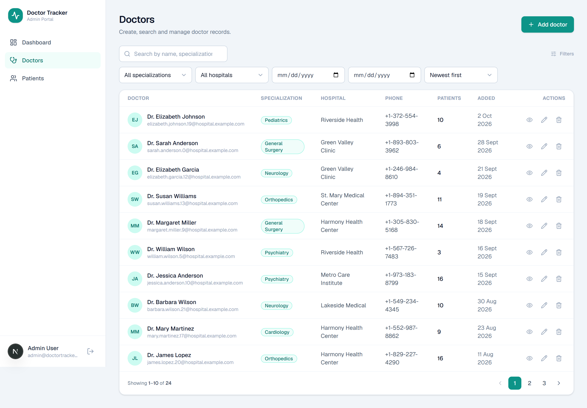
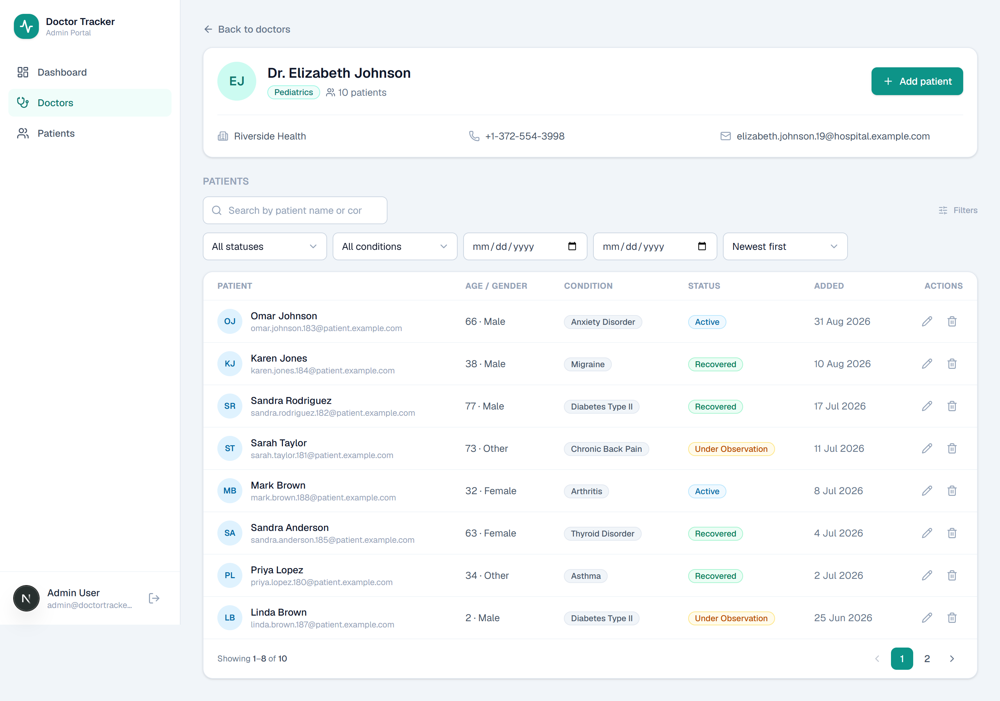
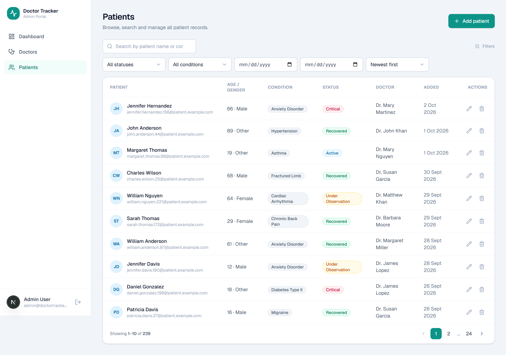
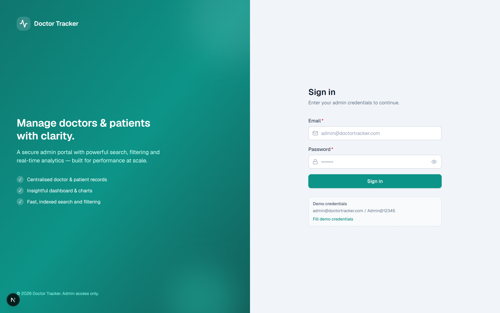
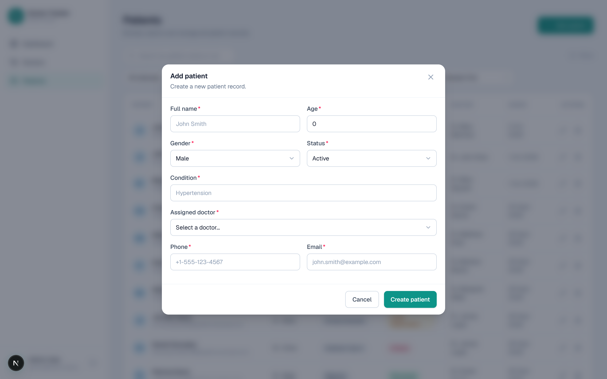
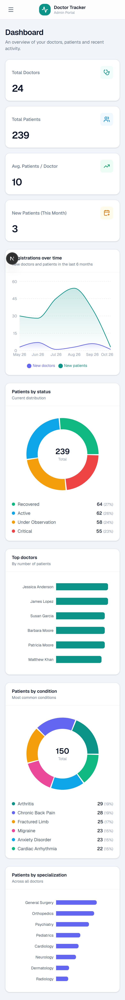
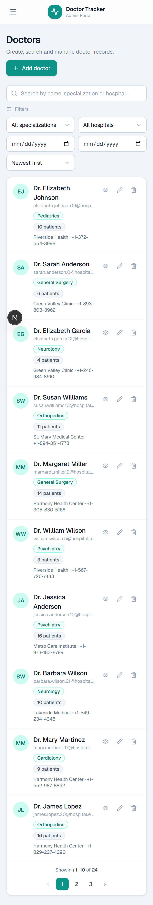
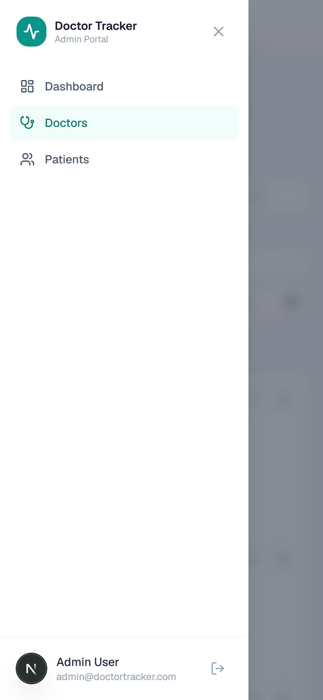

# 🩺 Doctor Tracker

A secure, full-stack admin portal for managing **doctors** and their **patients**, with
fast search / filtering, clean CRUD workflows, and an analytics dashboard. Built as two
independent applications — a **Next.js** client and a standalone **Express + MongoDB**
REST API.

---

## 1. Description (Elevator Pitch)

Clinics and hospital administrators need a single, trustworthy place to keep track of who
their doctors are and which patients each one is treating — without wading through
spreadsheets. **Doctor Tracker** is that place: an authenticated admin portal where you can
create and manage doctors, drill into any doctor to add or remove their patients, manage a
global patient roster, and watch it all come together on a live analytics dashboard
(totals, patients-per-doctor, condition/status breakdowns, and 6-month registration
trends). It is engineered for performance — every list is paginated, searchable and
filterable against **indexed** MongoDB queries — and for a clean, responsive experience on
both desktop and mobile.

---

## 2. Tech Stack

| Layer            | Technology |
| ---------------- | ---------- |
| **Client**       | Next.js 16 (App Router), React 19, TypeScript, Tailwind CSS v4 |
| **Server state** | TanStack Query (React Query) v5 |
| **Forms**        | React Hook Form + Zod |
| **Charts**       | Recharts |
| **Icons / Toast**| lucide-react, Sonner |
| **API**          | Node.js, Express, TypeScript (RESTful) |
| **Database**     | MongoDB + Mongoose (indexed) |
| **Auth**         | JWT in an httpOnly cookie, bcrypt password hashing |
| **Validation**   | Zod (shared shape on client & server) |

---

## 3. Features

**Authentication**
- Secure email/password login; passwords hashed with bcrypt.
- JWT issued in an **httpOnly** cookie; every protected API route is guarded server-side.
- Login rate-limiting; client-side route guard for UX redirects.

**Doctor Management**
- Create / edit / delete doctors (name, specialization, hospital, phone, email).
- List with **search** (name / specialization / hospital), **filters** (specialization,
  hospital, created-date range), **sort** and **pagination**.
- Drill into a doctor to **view, add and remove** their patients.
- Deleting a doctor cascades to their patient records.

**Patient Management**
- Dedicated patients page: list **all** patients, create / edit / delete.
- **Search** (name / condition), **filters** (status, condition, date range), sort, pagination.
- Each patient is linked to a doctor (shown and editable).

**Dashboard & Data Visualization**
- KPIs: total doctors, total patients, avg. patients per doctor, new patients this month.
- Charts: 6-month registration trend (area), patients by status (donut), top doctors by
  patient count (bar), patients by condition (donut), patients by specialization (bar).
- All metrics are computed with **server-side aggregation pipelines** in a single request.

**UX**
- Responsive layout (collapsible sidebar → mobile drawer), skeleton loaders, empty states,
  optimistic-feeling cache updates, toasts, and accessible focus states.

---

## 4. Setup Guide

### Prerequisites
- **Node.js ≥ 20.9**
- **MongoDB** — via Docker *(recommended)* **or** the built-in no-Docker fallback (below)

### 1) Clone & configure environment

```bash
# from the project root
cp server/.env.example server/.env
cp client/.env.example client/.env.local
```

`server/.env.example`:

```env
PORT=4000
NODE_ENV=development
MONGODB_URI=mongodb://localhost:27017/doctor_tracker
JWT_SECRET=change_me_to_a_long_random_secret
JWT_EXPIRES_IN=7d
CLIENT_URL=http://localhost:3000
ADMIN_NAME=Admin User
ADMIN_EMAIL=admin@doctortracker.com
ADMIN_PASSWORD=Admin@12345
```

`client/.env.example`:

```env
NEXT_PUBLIC_API_URL=http://localhost:4000/api
```

### 2) Install dependencies

```bash
npm run install:all
# (or: cd server && npm i   then   cd ../client && npm i)
```

### 3) Start MongoDB

**Option A — Docker (recommended)**

```bash
npm run db:up      # docker compose up -d  (MongoDB 7 on :27017)
```

**Option B — No Docker**

Starts a real, on-disk MongoDB using a binary that is downloaded & cached automatically on
first run. Keep it running in its own terminal:

```bash
npm run db:local   # MongoDB on :27017, data persisted in server/.mongo-data
```

### 4) Seed the database

Creates the admin account plus realistic sample doctors & patients (spread over 6 months so
the charts are meaningful):

```bash
npm run seed
```

### 5) Run the apps

```bash
npm run dev        # runs the API (:4000) and the client (:3000) together
```

Open **http://localhost:3000** and sign in:

> **Email:** `admin@doctortracker.com`  **Password:** `Admin@12345`

### Handy scripts (root `package.json`)

| Script | What it does |
| ------ | ------------ |
| `npm run install:all` | Install client + server deps |
| `npm run db:up` / `db:down` | Start / stop the Docker MongoDB |
| `npm run db:local` | Start a no-Docker MongoDB |
| `npm run seed` | Seed the database |
| `npm run dev` | Run API + client concurrently |
| `npm run build` | Production build of both apps |

---

## 5. System Architecture

Two independently deployable apps communicate over a REST boundary:

```
┌───────────────────────────┐        HTTP (REST, JSON)        ┌───────────────────────────┐
│      Next.js Client        │   ───────────────────────────► │     Express REST API       │
│   (App Router, :3000)      │   ◄─────────────────────────── │        (:4000)             │
│                            │     httpOnly JWT cookie         │                            │
│  • Pages (dashboard/       │                                 │  routes → middleware →     │
│    doctors/patients/login) │                                 │  controllers → Mongoose    │
│  • TanStack Query cache    │                                 │                            │
│  • Axios (withCredentials) │                                 │  • authenticate (JWT)      │
│  • React Hook Form + Zod   │                                 │  • validate (Zod)          │
│  • Recharts visualizations │                                 │  • central error handler   │
└───────────────────────────┘                                 └─────────────┬─────────────┘
                                                                             │ Mongoose (pooled)
                                                                             ▼
                                                                  ┌────────────────────┐
                                                                  │      MongoDB        │
                                                                  │ users / doctors /   │
                                                                  │ patients (indexed)  │
                                                                  └────────────────────┘
```

**Request flow (example: `GET /api/doctors?search=...&page=2`)**
1. Client builds a cleaned query object and calls the API via Axios (`withCredentials`).
2. Express runs `authenticate` (verifies the JWT cookie) → `validate` (Zod coerces/validates
   query params) → the doctor controller.
3. The controller builds a Mongo filter (text search + filters + date range), runs the page
   query and the count **in parallel** (`.lean()` for plain objects), attaches per-page
   patient counts via an aggregation, and returns `{ data, meta }`.
4. TanStack Query caches the result by a structured key and keeps the previous page visible
   while the next one loads.

**Folder structure**

```
Doctor Tracker/
├── server/                     # Express REST API (TypeScript)
│   └── src/
│       ├── config/             # env validation, Mongo connection
│       ├── models/             # Mongoose schemas + indexes (User/Doctor/Patient)
│       ├── validators/         # Zod schemas (body/query/params)
│       ├── middleware/         # auth, validate, error handling
│       ├── controllers/        # business logic (doctors/patients/dashboard/auth)
│       ├── routes/             # Express routers
│       ├── utils/              # ApiError, asyncHandler, token, pagination, query helpers
│       └── seed/               # database seeder
├── client/                     # Next.js app (TypeScript)
│   └── src/
│       ├── app/                # routes: login, (protected)/{dashboard,doctors,patients}
│       ├── components/         # ui/, layout/, charts/, doctors/, patients/, providers/
│       ├── hooks/              # React Query hooks + useDebounce
│       └── lib/                # api client, types, schemas, query keys, utils
├── docker-compose.yml          # MongoDB 7
└── README.md
```

### API Reference

All routes are prefixed with `/api`. Everything except `POST /auth/login` requires auth.

| Method | Endpoint | Description |
| ------ | -------- | ----------- |
| POST   | `/auth/login` | Log in, set httpOnly cookie |
| POST   | `/auth/logout` | Clear the auth cookie |
| GET    | `/auth/me` | Current user |
| GET    | `/doctors` | List (search, filters, sort, pagination) |
| POST   | `/doctors` | Create a doctor |
| GET    | `/doctors/:id` | Get a doctor (+ patient count) |
| PATCH  | `/doctors/:id` | Update a doctor |
| DELETE | `/doctors/:id` | Delete a doctor (+ cascade patients) |
| GET    | `/doctors/:id/patients` | List a doctor's patients |
| POST   | `/doctors/:id/patients` | Add a patient under a doctor |
| GET    | `/doctors/meta/options` | Distinct specializations/hospitals (filters) |
| GET    | `/doctors/meta/list` | Lightweight `{_id, name, specialization}` list for selects |
| GET    | `/patients` | List (search, filters, sort, pagination) |
| POST   | `/patients` | Create a patient |
| GET/PATCH/DELETE | `/patients/:id` | Get / update / delete a patient |
| GET    | `/patients/meta/options` | Distinct conditions (filters) |
| GET    | `/dashboard/stats` | Aggregated analytics |

---

## 6. Technical Decisions (Deep Dive)

### Decision 1 — TanStack Query (React Query) for server state, not Redux/Context

**Context.** Almost all state in this app is *server state*: lists of doctors/patients,
dashboard metrics, the current user. That data is asynchronous, shared across pages, and
must stay consistent after every create/update/delete.

**Why not Redux or Context?** Redux would mean hand-writing async thunks, loading/error
flags, cache bookkeeping and invalidation for every resource — a lot of boilerplate that
mostly re-implements a cache. A single global Context holding all data causes every consumer
to re-render on any change and still leaves caching/refetching to us.

**What we chose & why.** TanStack Query treats the server as the source of truth and gives us,
for free: request **deduplication** and **caching** (keyed by `['doctors','list',params]`),
`staleTime` to avoid redundant refetches, **`keepPreviousData`** so paginated/filtered tables
don't flash empty while the next page loads, declarative **loading/error** states, and
targeted **invalidation** — e.g. creating a patient invalidates the patient list, the doctor
list (counts) *and* the dashboard in one place. Components only re-render for the queries they
subscribe to, which directly satisfies the "avoid unnecessary re-renders" requirement.
Lightweight client UI state (modals, filter inputs) stays in local `useState`, and auth is a
thin Context wrapper around a `me` query.

### Decision 2 — Separate Express backend with an httpOnly-cookie JWT

**Context.** The spec calls for a standalone Node/Express REST API and a separate Next.js
client. That means the browser talks cross-origin (`:3000` → `:4000`) and we must choose how
to carry the session.

**The options.** (a) JWT in `localStorage` + `Authorization` header, or (b) JWT in an
**httpOnly cookie**.

**What we chose & why.** We issue the JWT in an **httpOnly, SameSite** cookie. It is never
readable by JavaScript, which removes the most common token-theft vector (XSS), and the
browser attaches it automatically — Axios just needs `withCredentials: true` and the API sets
`cors({ credentials: true })`. Because the client and API are different origins, protection is
layered correctly: the **real** boundary is server-side — every protected route runs the
`authenticate` middleware and rejects invalid/missing tokens (verified in testing, e.g.
`GET /doctors` returns `401` without a cookie). The client-side `AuthGuard` is purely a UX
concern (redirect to `/login`, show a spinner), never the security mechanism. The API also
returns the token in the login body so non-browser clients (e.g. mobile) can use the
`Authorization: Bearer` fallback.

### Bonus — Query optimization & indexing

- **Indexes matched to access patterns:** text indexes for search
  (`doctor{name,specialization,hospital}`, `patient{name,condition}`), single-field indexes
  for filter dropdowns (specialization, hospital, condition, status), a `createdAt` index for
  date-range filtering + default sort, and a compound `{doctor, createdAt}` index so a
  doctor's patients come back pre-sorted.
- **Lean reads** (`.lean()`) return plain objects for list endpoints (no hydration overhead).
- **Parallelism:** page query + count (+ aggregations) run via `Promise.all`.
- **Dashboard** uses aggregation pipelines (`$group`, `$lookup`) so counts happen in the DB,
  not by shipping rows to Node.
- **Client:** debounced search (400 ms), `keepPreviousData` pagination, memoized derived data.

---

## 7. Visual Evidence

> Screenshots of the running application (desktop & mobile).

### Desktop

| Dashboard | Doctors |
| --------- | ------- |
|  |  |

| Doctor detail (patients) | Patients |
| ------------------------ | -------- |
|  |  |

| Login | Add patient (form) |
| ----- | ------------------ |
|  |  |

### Mobile

| Dashboard | Doctors | Menu |
| --------- | ------- | ---- |
|  |  |  |

---

## 8. Evaluation Notes

- **Code structure:** clear separation (config / models / validators / middleware /
  controllers / routes) on the server; `ui` / `layout` / `charts` / feature folders +
  reusable hooks on the client.
- **Scalability:** stateless API (JWT) scales horizontally; indexes + pagination keep queries
  bounded; filter-option endpoints avoid loading whole collections; the REST contract lets the
  client and API scale and deploy independently.
